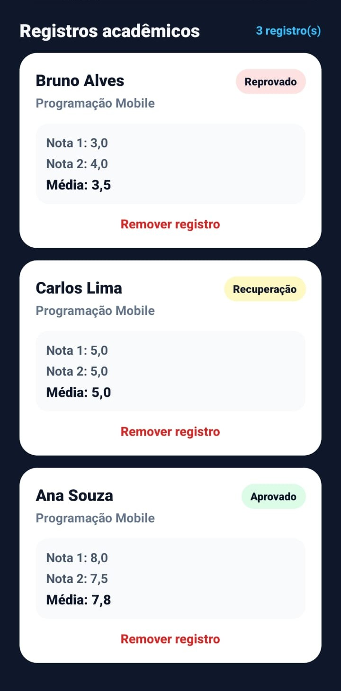
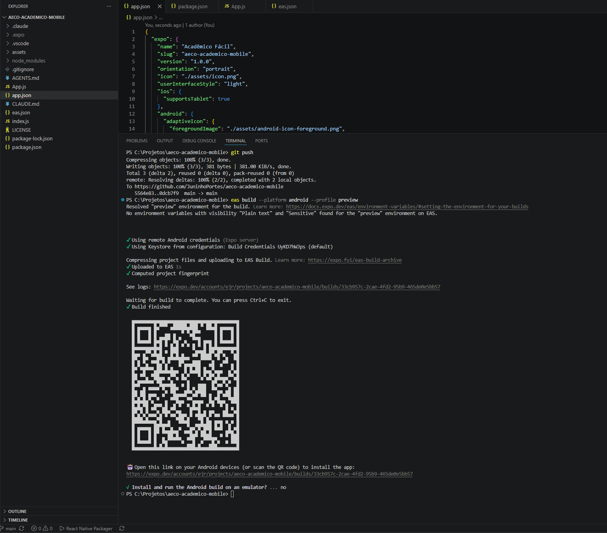
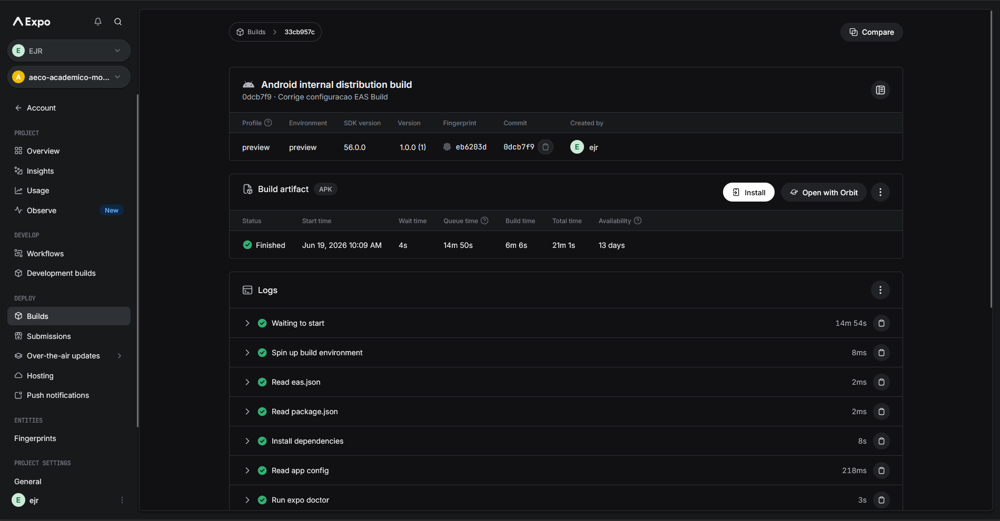
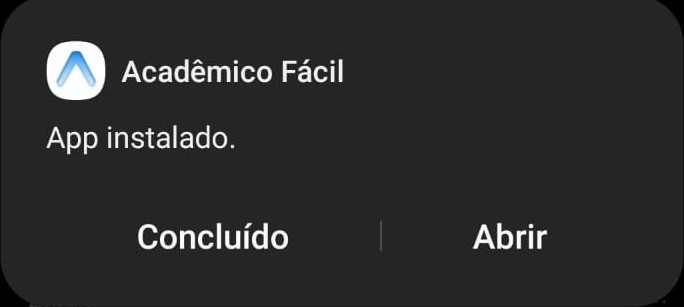

````markdown
# Acadêmico Fácil

Aplicativo mobile desenvolvido com **React Native**, **Expo** e **EAS Build** para a atividade AECO da disciplina de **Programação para Dispositivos Móveis**.

O projeto consiste em um mini sistema acadêmico que permite cadastrar alunos, informar duas notas, calcular a média automaticamente e exibir a situação final do estudante.

## Sobre o aplicativo

O **Acadêmico Fácil** foi desenvolvido com o objetivo de demonstrar o fluxo completo de desenvolvimento mobile com Expo:

```text
código → teste no Expo Go → build na nuvem → instalação → execução no celular físico
````

A aplicação permite:

* cadastrar o nome do aluno;
* cadastrar a disciplina;
* informar a primeira e a segunda nota;
* calcular automaticamente a média;
* classificar o aluno como **Aprovado**, **Recuperação** ou **Reprovado**;
* listar os registros cadastrados;
* remover registros da lista.

## Regras de classificação

A classificação do aluno é feita com base na média calculada:

| Média                                | Situação    |
| ------------------------------------ | ----------- |
| Maior ou igual a 7,0                 | Aprovado    |
| Maior ou igual a 5,0 e menor que 7,0 | Recuperação |
| Menor que 5,0                        | Reprovado   |

## Tecnologias utilizadas

* React Native
* Expo
* JavaScript
* EAS Build
* Git e GitHub
* Visual Studio Code

## Prints do aplicativo

### Tela inicial


### Registros acadêmicos cadastrados



## Build com EAS

O projeto foi configurado com o **EAS Build** para geração de um APK Android no perfil `preview`.

Comando utilizado para gerar o build:

```bash
eas build --platform android --profile preview
```

O build foi finalizado com sucesso na plataforma Expo/EAS, gerando um artefato APK para instalação em celular físico.





## Instalação no celular

Após a geração do APK, o link disponibilizado pelo EAS Build foi aberto no celular Android. Em seguida, o aplicativo foi instalado e executado no dispositivo físico.



## Como executar o projeto localmente

Para executar o projeto em ambiente de desenvolvimento, é necessário ter o **Node.js**, o **npm** e o **Expo** configurados.

Clone o repositório:

```bash
git clone https://github.com/JuninhoPortes/aeco-academico-mobile.git
```

Acesse a pasta do projeto:

```bash
cd aeco-academico-mobile
```

Instale as dependências:

```bash
npm install
```

Execute o projeto:

```bash
npx expo start
```

Depois, escaneie o QR Code com o aplicativo **Expo Go** no celular.

## Estrutura principal do projeto

```text
aeco-academico-mobile/
├── assets/
├── App.js
├── app.json
├── eas.json
├── package.json
├── package-lock.json
└── README.md
```

## Identificador Android

O identificador Android configurado para o aplicativo foi:

```text
br.edu.unipac.aecoacademico
```

## Conclusão

Este projeto permitiu praticar o fluxo completo de desenvolvimento mobile moderno utilizando Expo e EAS Build. Durante a atividade, foi possível criar uma aplicação funcional, testá-la no Expo Go, configurar o EAS Build, gerar um APK Android na nuvem e instalar o aplicativo em um celular físico.

```
```
